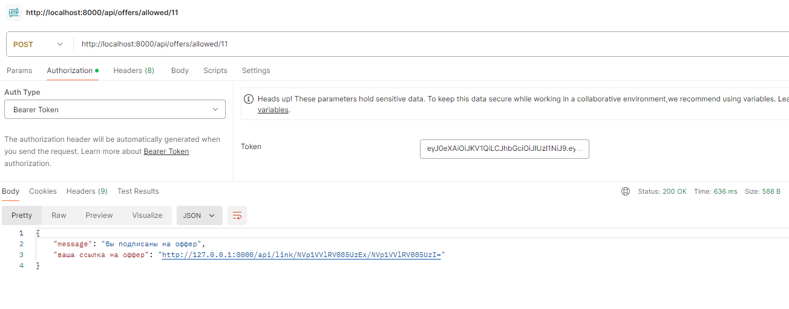

# 
Итоговый проект. Приложение SF-AdTech 

Выполнено в качестве практического задания на курсе "Продвинутый Backend"

Формулировка ТЗ:

 Приложение SF-AdTech — это трекер трафика, созданный для организации взаимодействия компаний (рекламодателей), которые хотят привлечь к себе на сайт посетителей и покупателей (клиентов), и владельцев сайтов (веб-мастеров), на которые люди приходят, например, чтобы почитать новости или пообщаться на форуме.

 Рекламодатель создаёт предложение (оффер), определяя URL страницы, на которую он хочет приводить людей. Например, это страница товара, который он хочет продавать. В оффере он также определяет стоимость перехода по ссылке. Скажем, 1 рубль за переход.

 Веб-мастера в системе видят создаваемые офферы, подписываются на них, после чего система выдаёт им специальные ссылки, которые они должны разместить в любом виде у себя на ресурсе. Ссылка эта ведёт не на целевой URL, а на систему-редиректор, которая фиксирует переход, а затем перенаправляет клиента на страницу сайта рекламодателя. 

 Описание приложения: 

+ При входе в приложение пользователь должен войти по логину и паролю либо пройти регистрацию.
+ В качестве логина выступает email пользователя.
+ Предусмотрено три роли для пользователей:
  - администратор;
  - рекламодатель;
  - веб-мастер.
+ При регистрации пользователь может выбрать роль: вебмастер или рекламодатель
+ Администратор может производить следующие действия:
    - авторизовывать на работу новых рекламодателей и веб-мастеров;
    - отключать их;
    - контролировать общий доход системы;
    - выводить статистику по выданным ссылкам, переходам, отказам (когда веб-мастер попытался перенаправить на оффер, на который он не подписан);
    - менять логин и пароль в личном кабинете.

+ Рабочий стол администратора:
  
+ Общая статистика по сиcтеме:
  
+ Личный кабинет:
  

+ Рекламодатель может производить следующие действия:
 - зарегистрироваться в системе;
 - авторизоваться в системе;
 - посмотреть список созданных им офферов;
 - увидеть кол-во веб-мастеров, подписанных на каждый из офферов;
 - создать новый оффер:
      - указать имя оффера;
      - указать стоимость перехода;
      - указать целевой URL;
      - определить темы сайта;
 - деактивировать оффер;
 - посмотреть расходы и кол-во переходов по офферу в разрезах:
      - день;
      - месяц;
      - год.
- менять логин и пароль в личном кабинете.

+ Рабочий стол рекламодателя:
  
  
+ Страница создания рекламодателя:
  
+ Страница статистики рекламодателя:
  

+ Вебмастер может производить следующие действия:
 - зарегистрироваться в системе;
 - авторизоваться в системе;
 - посмотреть список офферов, на которые он подписан;
 - подписаться на новый оффер и получить ссылку системы;
 - отписаться от оффера;
 - посмотреть расходы и кол-во переходов по офферу в разрезах:
    - день;
    - месяц;
    - год.
- менять логин и пароль в личном кабинете.

+ Рабочий стол вебмастера:
  
  
+ Страница статистики вебмастера:
  

 Маршруты API. 
  

+ Для получения JWT токена используется маршрут (ключи email  и password, метод post)
    http://localhost:8000/api/login
    

+ Все остальные маршруты API реализованы только для пользователей с правами вебмастера.
+ Для получения перечня доступных для подписи офферов для текущего вебмастера используется маршрут  
    http://localhost:8000/api/offers/allowed
    
+ Для получения перечня офферов на которые подписан текущий пользователь используется маршрут  
    http://localhost:8000/api/offers
    
+ Для подписки на доступный оффер используется маршрут 
    http://localhost:8000/api/offers/allowed/{id} 
    

+ Маршрут API обработки ссылок /link/{offer_id}/{user_id}', [LinkController::class, 'edit'];

#### Дополнительно
+ Интерфейс приложения реализован на Bootstrap 5.
+ Обмен между frontend и backend релизован на AJAX.
+ Все формы отправки используют CSRF-токен для защиты от CSRF аттак.
+ Защита от SQL-инъекций обеспечивается ORM Eloquent.

## Используемые технологии

* Laravel 10.48

* ORM Eloquent

* PHP 8.0

* Bootstrap 5.0

* JS

## Как открыть/запустить

Клонировать https://github.com/KorenevVyacheslav/PHP_Messenger в  папку c вашими доменами. В файле config.php переопределить константы для подключения к вашей БД. Выполнить команду "composer update" для загрузки папки 'vendor'. Запустить index.php. 